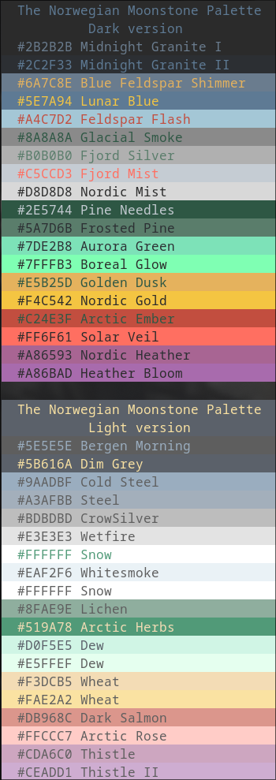

# Norwegian Moonstone

A calm northern color palette, inspired by nordic wild untamed nature.  
Base in this palette is a norwegian rock, called Larvikitt (Larvikite), also sometimes called Norwegian Moonstone. A beautiful dark rock, with lots of blue and silver spackles.  
Mixed together with our national flora, northern lights, late summer sunsets, deep blue fjords, and hars long cold winters.

I have included the first theme for alacritty, but some more tweaks is needed!  
Once the palette is locked, I will create some nice themes to go.  

*/Woofson*
