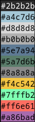

# Norwegian Moonstone

A calm northern color palette, inspired by norwegian wild untamed nature.  
Roots in this palette is a norwegian rock, called Larvikitt (Larvikite).  
A beautiful dark rock, with lots of blue and silver spackles.  
Mixed together with our national flora, northern lights, late summer sunsets, deep blue fjords, and hars long cold winters.

I have included the first initial Alacritty theme, but some more tweaks is needed!  
Once the palette is locked, I will create some nice themes to go.  

#2B2B2B - Midnight Granite  
#A4C7D6 - Feldspar Flash  
#D8D8D8 - Nordic Mist  
#B0B0B0 - Fjord Silver  
#5E7A94 - Lunar Blue  
#5A7D6B - Frosted Pine  
#8A8A8A - Glacial Smoke  
#F4C542 - Nordic Gold  
#7FFFB3 - Boreal Glow  
#FF6F61 - Solar Veil  
#A86BAD - Heather Bloom    

- Bolt J Woofson.
